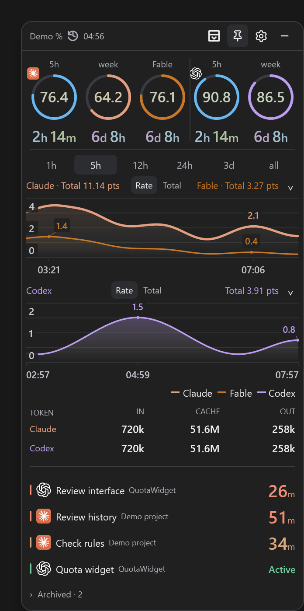
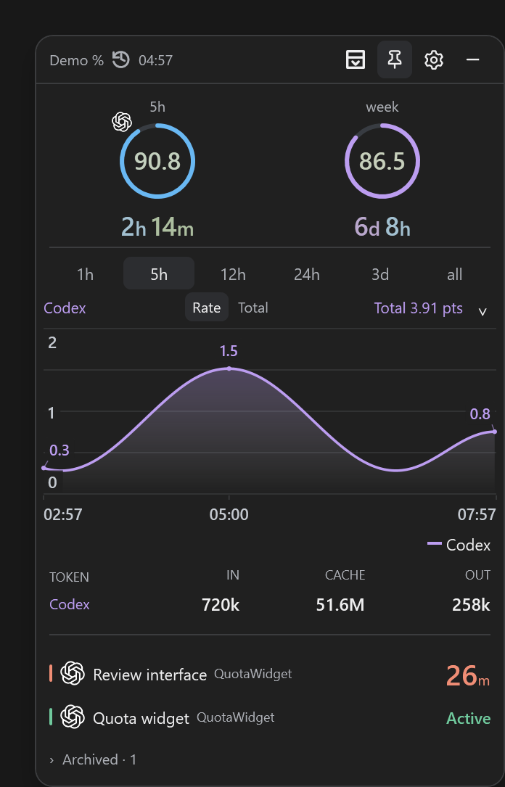
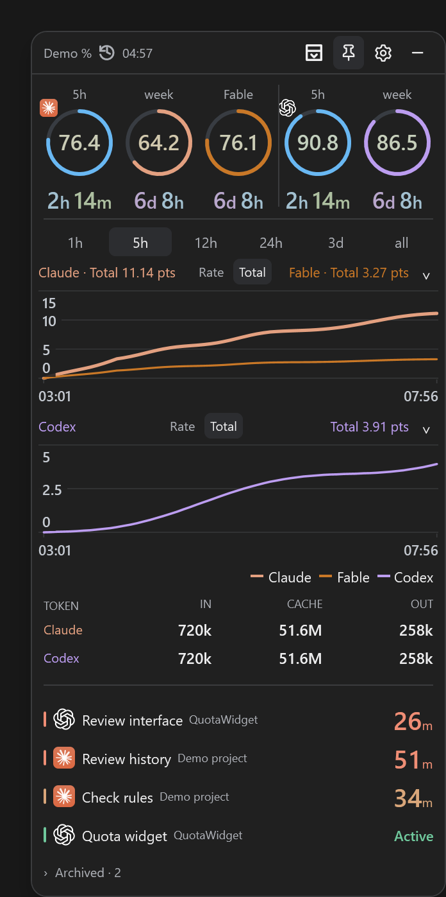
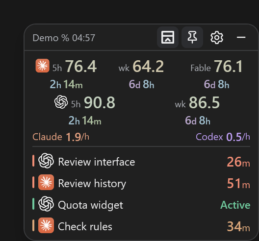
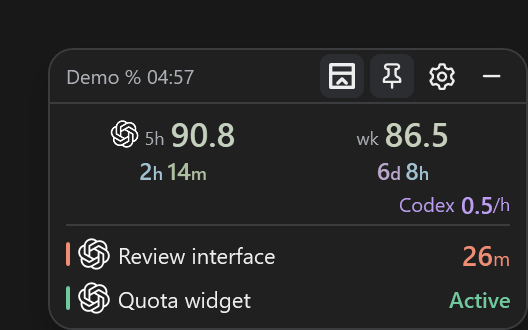
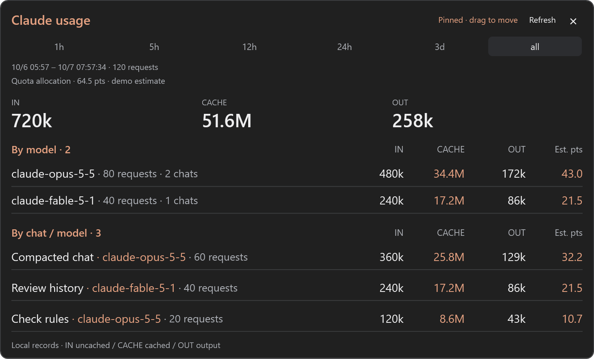
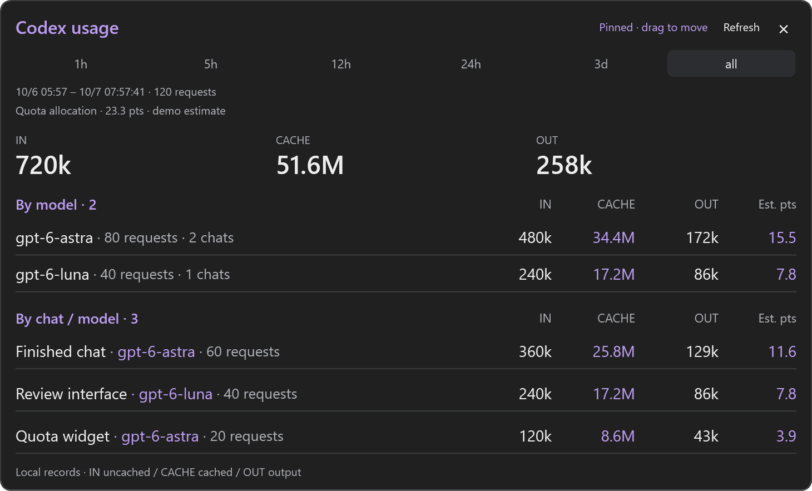
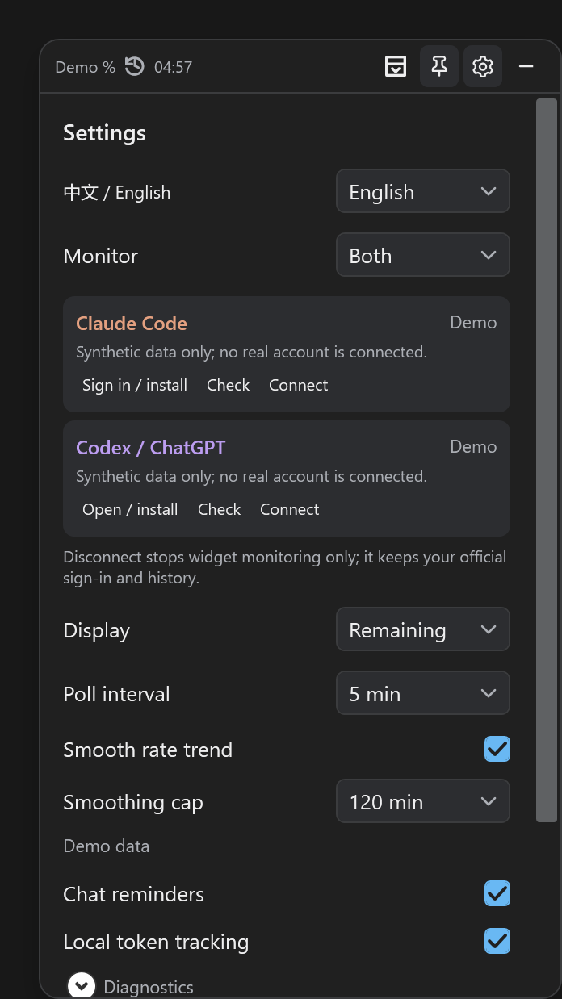

# QuotaWidget

**English** · [简体中文](README.zh-CN.md)

A small Windows desktop widget for Claude and Codex quota, usage trends, and local chat activity. See remaining quota and reset countdowns without reopening usage pages.

**[Download for Windows](https://github.com/HailiangLoo/QuotaWidget/releases/latest)** · [Privacy](docs/PRIVACY.md) · [Development & testing](CONTRIBUTING.md)

## Screenshots

All screenshots use synthetic demo data. Supports light and dark themes, full and compact modes, and Claude, Codex, or both. **Click any image to view it at full size.**

<table>
  <tr>
    <th width="33%">Claude + Codex · Full</th>
    <th width="33%">Codex · Full</th>
    <th width="33%">Cumulative view</th>
  </tr>
  <tr>
    <td align="center" valign="top"><a href="docs/images/both-expanded-en.png"></a></td>
    <td align="center" valign="top"><a href="docs/images/codex-expanded-en.png"></a></td>
    <td align="center" valign="top"><a href="docs/images/both-cumulative-en.png"></a></td>
  </tr>
  <tr>
    <th>Compact modes</th>
    <th>Usage details</th>
    <th>Settings</th>
  </tr>
  <tr>
    <td align="center" valign="top"><strong>Claude + Codex</strong><br /><a href="docs/images/both-compact-en.png"></a><br /><strong>Codex</strong><br /><a href="docs/images/codex-compact-en.png"></a></td>
    <td align="center" valign="top"><strong>Claude</strong><br /><a href="docs/images/claude-usage-en.png"></a><br /><strong>Codex</strong><br /><a href="docs/images/codex-usage-en.png"></a></td>
    <td align="center" valign="top"><a href="docs/images/settings-en.png"></a></td>
  </tr>
</table>

Each chart chooses Rate or Total independently. The numbers in its header remain recorded totals.

### Local usage details

Hover a provider's token row or usage heading, then click the card to pin it. Each provider has its own movable window showing input, cached-input and output tokens, grouped by model and by chat/model. Confirmed subagent usage is grouped under its parent chat. The initial range follows the full view, or starts at 1h in compact mode; each detail window then has independent **1h / 5h / 12h / 24h / 3d / all** buttons. Drag content to move either window; controls and scrolling retain their usual actions.

Visible pinned windows automatically refresh at the configured polling interval (5 minutes by default), preserving their range and scroll position. This only reads existing local records; it does not trigger quota requests or model calls. Hidden or closed windows do not refresh, and dragging or recent interaction briefly defers an update. **Refresh** remains available for an immediate update.

The **Est. pts** column apportions observed weekly quota using locally calibrated model/input/cache/output weights. It appears only after held-out validation and allocation-stability checks; insufficient or conflicting data shows a dash. This assumes the quota consumption is represented in local logs. It is an estimate, not a provider bill. All names, projects and numbers shown here are synthetic.

### Settings

The gear is available in full and compact modes. Settings includes language, provider connections, display units, polling, smoothing, chat cache reminders and local token tracking. Smoothing caps are **60, 90, 120 (default), and 150 minutes**. The estimator adapts below that cap, so choosing 150 does not force every curve to use a 150-minute window. This preference affects the rate curve, not recorded cumulative points or the observed one-hour average.

## Features

- Claude: five-hour, total weekly, and Fable weekly quota.
- Codex: weekly quota, plus a five-hour gauge when the account's interface provides it.
- Independent rate or cumulative views for each provider, with 1h, 5h, 12h, 24h, 3d, and all-history ranges.
- Local chat activity, cache reminders, token summaries, and confirmed subagent grouping.
- Always on top, system tray, compact mode, and layouts that adapt to narrow windows.
- English and Simplified Chinese, with an instant language switch in Settings.

## Getting started

1. Download `QuotaWidget-v0.13.5-win-x64.zip` from [Releases](https://github.com/HailiangLoo/QuotaWidget/releases/latest) and extract it into a folder of your choice.
2. Open `QuotaWidget.exe` or `Start Widget.cmd`. The download includes the .NET runtime; no separate runtime installation is needed.
3. On first launch, choose the providers to monitor and complete official sign-in, then select **Start monitoring**. No quota collection or chat-log reading begins before this step. The gear remains available in compact mode.
4. Settings shows each provider’s connection status, sign-in/install instructions, a connection check, and a disconnect button. Disconnect stops widget monitoring; it does not sign out of the official app or delete history.
5. Choose a language in Settings. Language defaults to the Windows display language: Chinese on Chinese systems, English otherwise. You can choose **English** or **简体中文** explicitly.

**Codex:** install and sign in to the official Codex Windows app first. The widget checks the signature of the bundled CLI, queries quota through it, and reuses the existing sign-in.

Official installation and sign-in guides: [Codex / ChatGPT](https://learn.chatgpt.com/docs/app), [ChatGPT authentication](https://learn.chatgpt.com/docs/auth), and [Claude Code](https://code.claude.com/docs/en/setup).

**Claude:** requires a supported official Claude Code CLI, or the CLI bundled with the Claude Windows app. Open `Sign in to Claude.cmd` to complete the widget's separate sign-in. If no compatible CLI is found, update the official app or set `claudeExePath` in `settings.json`.

To preview the widget without an account, open `Demo.cmd`. Demo data is stored separately from real data.

Requires Windows 10/11, x64. Release binaries are currently unsigned.

## Data and accuracy

Data stays under `%USERPROFILE%\.quotawidget\data` for the current Windows user. It is not uploaded to GitHub with the application. Use `--data-dir "your-directory"` to choose a different location. The app does not add itself to Windows startup automatically.

Official quota readings are the source of truth. **Rates estimate a trend from discrete quota readings and local activity.** Totals use valid raw readings; gaps are not invented or filled with zero. Activity on other devices or the web may be absent from local logs. Token totals are not an account bill and are not converted into precise per-chat weekly quota costs.

See [How smoothing works and its accuracy limits](docs/ALGORITHM.md). Smoothing estimates timing; it cannot reveal an exact instantaneous consumption rate. Fable-only fragments can share a rate stroke. Cumulative views share a stroke only when the entire selected recorded range is confirmed Fable-only; mixed history retains both complete curves. Header totals remain independent.

The two providers use different quota units and cannot be added together. Fable conversion is enabled only for recognized supported plans. Provider interfaces, plans, and quota windows can change; a missing window is never presented as zero usage.

See [Privacy](docs/PRIVACY.md) for the data access details. Use demo screenshots or redacted information in bug reports; do not upload your entire data directory.

## Build from source

Install the .NET 10 SDK on Windows, then run:

```powershell
dotnet run --project tests/QuotaWidget.Tests -c Release
dotnet run --project tests/QuotaWidget.UiTests -c Release
powershell -File scripts/Build-Release.ps1
```

Release files are written to `artifacts/`. Tests do not require a signed-in account by default. Checks that use installed official CLIs are opt-in; see [CONTRIBUTING.md](CONTRIBUTING.md).

For an English demo, run `QuotaWidget.exe --demo --language en`. Use `--language zh-CN` for Chinese or `--language auto` to follow Windows.

## License

Source code and original artwork are licensed under [MIT](LICENSE). This is an independent project, not an official Anthropic or OpenAI product, and is not endorsed by either company. Their names and trademarks belong to their respective owners. Provider icons are read from the user's local app installation and are not redistributed in source or release packages. See [NOTICE](NOTICE.md) for runtime and trademark details.
