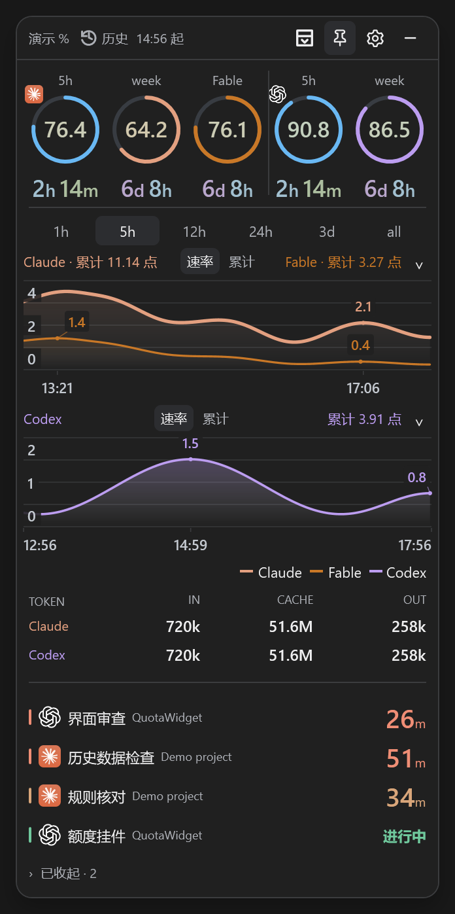
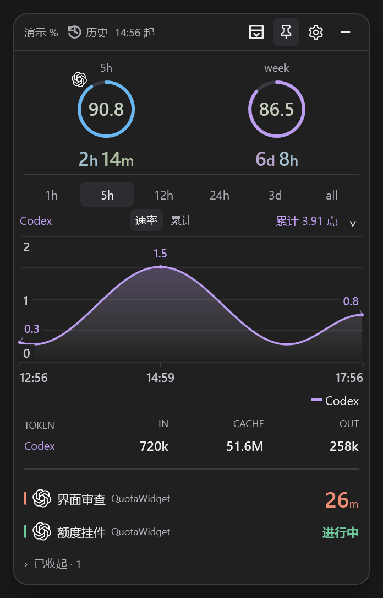
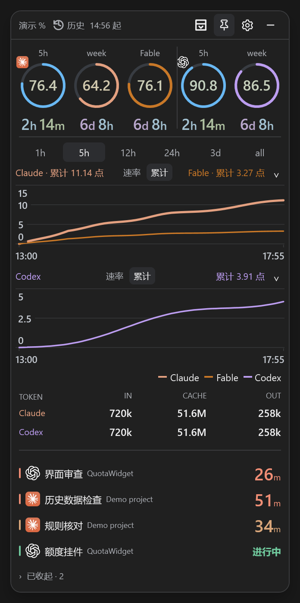
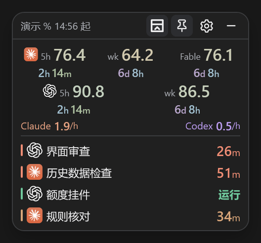
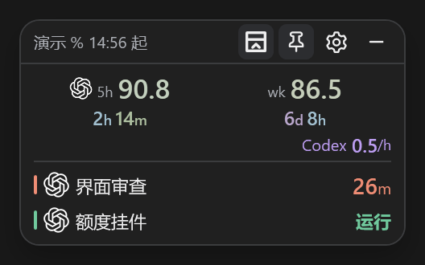
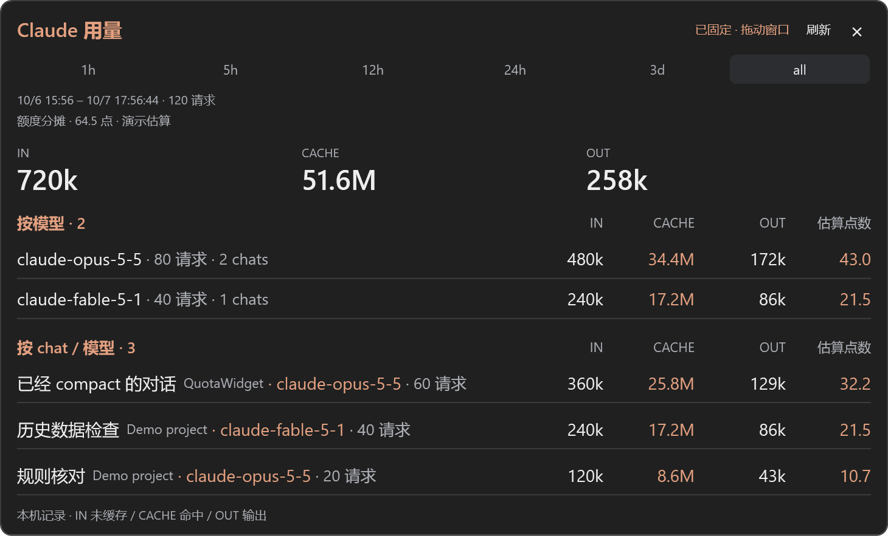
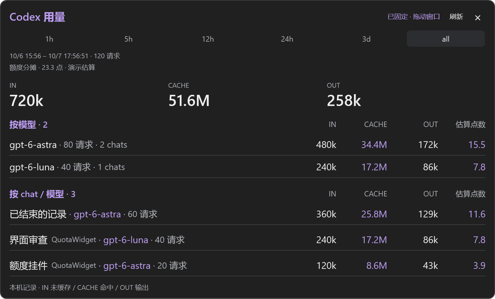
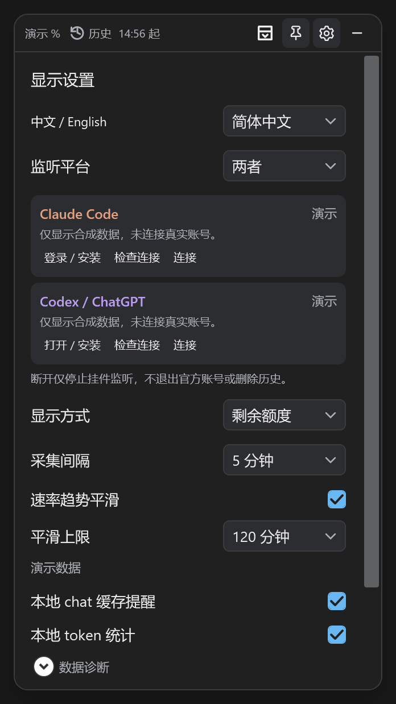

# QuotaWidget · 额度小挂件

[English](README.md) · **简体中文**

A small Windows desktop widget for Claude and Codex quota, usage trends, and local chat activity.

一个常驻桌面的 Windows 小挂件：看剩余额度、重置倒计时和消耗趋势，不用来回打开用量页面。

**[下载 Windows 版](https://github.com/HailiangLoo/QuotaWidget/releases/latest)** · [隐私说明](docs/PRIVACY.zh-CN.md) · [开发与测试](CONTRIBUTING.zh-CN.md)

## 界面

截图全部使用合成演示数据。支持深浅主题、完整/精简模式，以及仅 Claude、仅 Codex 或同时监听。**点击任意图片可查看原图。**

<table>
  <tr>
    <th width="33%">Claude + Codex · 完整模式</th>
    <th width="33%">Codex · 完整模式</th>
    <th width="33%">累计视图</th>
  </tr>
  <tr>
    <td align="center" valign="top"><a href="docs/images/both-expanded.png"></a></td>
    <td align="center" valign="top"><a href="docs/images/codex-expanded.png"></a></td>
    <td align="center" valign="top"><a href="docs/images/both-cumulative.png"></a></td>
  </tr>
  <tr>
    <th>精简模式</th>
    <th>用量明细</th>
    <th>设置</th>
  </tr>
  <tr>
    <td align="center" valign="top"><strong>Claude + Codex</strong><br /><a href="docs/images/both-compact.png"></a><br /><strong>Codex</strong><br /><a href="docs/images/codex-compact.png"></a></td>
    <td align="center" valign="top"><strong>Claude</strong><br /><a href="docs/images/claude-usage.png"></a><br /><strong>Codex</strong><br /><a href="docs/images/codex-usage.png"></a></td>
    <td align="center" valign="top"><a href="docs/images/settings.png"></a></td>
  </tr>
</table>

每个图可以独立选择速率或累计，顶部数字始终保留已记录累计。

### 本机用量明细

悬停在平台的 token 行或用量标题上，再点击卡片即可固定。Claude 和 Codex 各有一个可拖动的明细窗口，展示 IN 未缓存输入、CACHE 缓存命中、OUT 输出，并同时按模型和 chat / 模型分组。有项目信息时，chat 名称后会以较小、较淡的文字显示项目名。确认归属的 subagent 用量计入父 chat。初始范围沿用完整视图，精简模式默认 1h；明细中可独立选择 **1h / 5h / 12h / 24h / 3d / all**。主窗口和固定明细都可拖动内容区域，按钮和滚动保留原操作。

**估算点数**按实际观测的周额度总量、模型及 IN / CACHE / OUT 用量分摊。只有历史校准、独立时段验证和权重稳定性检查通过时才显示；样本不足或冲突时显示横线。这依赖“相关消耗已被本机日志覆盖”的假设，是估算，不是官方账单。

可见的固定窗口会按采集间隔自动刷新，默认每 5 分钟一次，保留时间范围和滚动位置。刷新只读取已有本地记录，不触发额外额度请求或模型调用；隐藏、关闭后不刷新，拖动或刚操作时会稍后更新。仍可点击“刷新”立即更新。

token 列保留本机原始统计，估算列不改写原始记录。上图的名称、项目和数值全部来自合成演示数据。

### 设置

完整和精简模式都可通过齿轮进入设置，调整语言、平台连接、显示方式、采样、平滑、chat 缓存提醒和本机 token 统计。平滑上限提供 **60、90、120（默认）、150 分钟**。算法在上限内自适应，选择 150 不代表每段曲线都强制使用 150 分钟；这个设置只影响速率曲线，不改变实际累计点数或近一小时观测均速。

## 能做什么

- Claude：5 小时、总周额度、Fable 周额度。
- Codex：周额度；接口返回 5 小时窗口时自动显示。
- 两个平台各自选择速率或累计，查看 1h、5h、12h、24h、3d 或全部历史。
- chat 活动、缓存计时提示、本机 token 汇总及子代理归属。
- 置顶、托盘、精简模式，窄窗口自动调整布局。

## 开始使用

1. 在 [Releases](https://github.com/HailiangLoo/QuotaWidget/releases/latest) 下载 `QuotaWidget-v0.13.9-win-x64.zip`，解压到自己的文件夹。
2. 双击 `QuotaWidget.exe`，或者 `启动小挂件.cmd`。发布包包含 .NET 运行时，无需另外安装。
3. 首次启动先选择监听平台、完成官方登录，再点“开始监听”。开始前不采集额度或读取 chat 日志。精简模式也保留齿轮设置入口。
4. 设置显示各平台的当前状态，并提供登录/安装、检查连接和断开按钮。断开只停止挂件监听，不退出官方应用的账号，也不删除历史。
5. 设置中选择语言。语言默认跟随系统，也可选择简体中文或 English；切换立即生效。

**Codex**：先安装并登录官方 Codex Windows 应用。挂件通过应用附带、经签名校验的 CLI 查询额度，使用现有登录状态。

官方安装与登录说明：[Codex / ChatGPT](https://learn.chatgpt.com/docs/app)、[ChatGPT 登录](https://learn.chatgpt.com/docs/auth)、[Claude Code](https://code.claude.com/docs/en/setup)。

**Claude**：需要受支持的官方 Claude Code CLI，或 Claude Windows 应用附带的 CLI。双击 `登录Claude.cmd` 完成挂件专用登录；它使用独立配置目录。找不到兼容 CLI 时，在 settings.json 中指定 claudeExePath 或更新官方应用。

只想先看效果，双击 `演示模式.cmd`。演示数据与真实数据分开存放。

系统要求：Windows 10/11，x64。界面支持中文和英文。初版二进制尚未签名。

## 数据与精度

数据保存在当前 Windows 用户的 `%USERPROFILE%\.quotawidget\data`，不会随程序目录上传到 GitHub。可用 `--data-dir "你的目录"` 指定其他位置。程序不自动添加开机启动项。

额度以官方读数为准。**速率是根据离散额度读数和本机活动估算的趋势**；累计取有效原始读数，缺口不补造。其他设备或网页版活动可能不在本机记录内；token 统计不是账号账单，也不换算成精确的单 chat 周额度。

[平滑算法和精度边界](docs/ALGORITHM.zh-CN.md)详细说明了观测、均速和趋势估算的区别。只用 Fable 的片段可在速率图中共线；累计图仅在整个所选记录范围都确认只用 Fable 时共线，含混合历史时保留两条完整曲线。顶部实际点数始终各自保留。

两个平台的额度单位不同，不能相加。Fable 折算只在已识别的支持套餐上启用。平台接口、套餐和窗口可能变化，缺失的窗口不会显示成 0。

详细的数据访问范围见 [隐私说明](docs/PRIVACY.zh-CN.md)。提交问题时，请使用演示截图或脱敏信息，避免上传整个数据目录。

## 从源码构建

Windows 上安装 .NET 10 SDK，然后运行：

```powershell
dotnet run --project tests/QuotaWidget.Tests -c Release
dotnet run --project tests/QuotaWidget.UiTests -c Release
powershell -File scripts/Build-Release.ps1
```

发布文件位于 `artifacts/`。测试默认不需要登录账号；依赖已安装官方 CLI 的检查须显式开启，见 [CONTRIBUTING.zh-CN.md](CONTRIBUTING.zh-CN.md)。

## 许可

项目源码及原创图标采用 [MIT](LICENSE)。本项目独立维护，非 Anthropic 或 OpenAI 官方产品，也未获得其背书。相关名称和商标归各自所有者所有；平台图标从用户本机安装中读取，不随源码或发布包分发。运行时及商标说明见 [NOTICE](NOTICE.md)。
