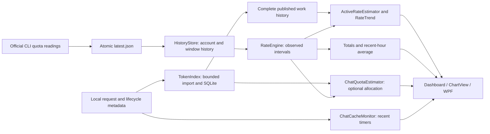

# Architecture and evidence boundaries

[简体中文](ARCHITECTURE.zh-CN.md) · [Chart semantics](ALGORITHM.md)

QuotaWidget has two production projects: a Core library and a WPF app. Keep acquisition, recorded facts, estimates and presentation distinct within those projects. A new layer or source must remove more uncertainty and maintenance than it adds.

## Data flow

| Boundary | Responsibility | Must not do |
| --- | --- | --- |
| Collectors | Verify official executable, request quota, respect retry/backoff, atomically persist the result | Parse or copy the user's existing authentication files |
| HistoryStore / RateEngine | Keep provider, account, window, time and coverage; derive valid intervals and raw averages | Smooth the ledger, turn a missing reading into zero, move increments between chats |
| TokenIndex / TokenStore | Deduplicate requests, retain numeric usage and ownership/lifecycle metadata, publish only complete work generations | Publish an unfinished import as proof that no work happened |
| ActiveRateEstimator / RateTrend | Estimate timing on the supported active clock; conserve observed mass; keep unlocated increments | Fill confirmed idle, cross real collection gaps, claim an instantaneous measured rate |
| ChatQuotaEstimator | Fit relative token weights, validate held-out windows and allocation stability, decline unsupported estimates | Present inferred shares as provider billing records |
| ChartView / FableDisplay | Crop a stable estimate, share an evidenced Fable-only stroke, disclose incompatible component estimates | Correct counters to make lines agree or count Fable twice |

The old 15-minute ledger smoother, quota-pairing algorithm and manual conversion setting have been removed. There is one production trend path. Raw display still uses interval averages; cumulative display uses the original increments. Supported Fable conversion lives in `QuotaUnits`.

## Why a quota field in a chat log is not a chat bill

OpenAI describes `account/rateLimits` as the user's account limits, with usage within each quota window. The containing log identifies where a snapshot was received, not which request caused the entire difference from a previous snapshot. [App-server reference](https://learn.chatgpt.com/docs/app-server)

For example, two concurrent chats can each observe the account move from 20 to 23. Summing their independent differences would assign six points from a three-point account increase. Ordering and deduplicating snapshots gives a better account timeline; it does not identify the split between those chats. Quantization, reporting delay, other devices and account changes remain relevant.

Claude Code's statusline can also expose quota-window readings. Statusline updates have several triggers and may be debounced or cancelled; expired windows are dropped. A callback is not a guaranteed per-request billing event, nor proof that every client or subagent is covered. [Statusline reference](https://code.claude.com/docs/en/statusline)

Before adding either as an acquisition source, establish account/meter/window identity, observation freshness, deduplication, missing-data behavior and agreement with the current source. Such a source may reduce collection cost or detection delay. It must not bypass attribution uncertainty. QuotaWidget currently does not install a statusline hook or change another app's settings.

## Deliberate boundaries

- Clean reset continuity uses the configured collection cadence and explicit continuous work. The crossing remains invalid for accounting. Slow polling alone is not a task boundary; failures, missed samples and actual work ends still break estimation.
- `latest.json` is the durable collector-to-model boundary. Its cheap file check also supports restart recovery and external snapshot ingestion; a second in-memory delivery path is not required.
- Recent cache timers and historical token import have different horizons, cursor recovery and completeness requirements. Reuse shared parsing and lifecycle helpers where semantics match; do not tie a current timer to completion of an archival import.
- Each provider's model keeps its own history, identity and storage. Shared display preferences do not justify sharing account state.
- The eight-day limit bounds live history/indexing and calibration, not disk retention. Old quota files support archive/calendar views; deleting older token rows would change historical reports. Current-chat rows' 24-hour retention is a separate UI rule.
- SQLite stores coverage facts. A read-only snapshot formats them in the current language, with a fallback for old metadata. Translation remains presentation-only.
- Several successful regressions are evidence of stability, not proof of unique per-chat costs. Correlated workloads or unrecorded remote usage can remain indistinguishable. Unknown estimates stay unknown.
- The self-contained single EXE includes the runtime deliberately. No service, mandatory runtime installation, updater, hook or new framework is needed for these changes.

## Verification

Run the core and WPF suites from [Development](../CONTRIBUTING.md). Protect conservation (confirmed area plus unlocated increments), nonnegative finite rates, monotone cumulative amounts, account isolation, exact known work boundaries, no future samples and view-range independence. Synthetic counterexamples belong in tests. Private-history replays compare behavior locally; never commit raw logs, identities or credentials as fixtures.
